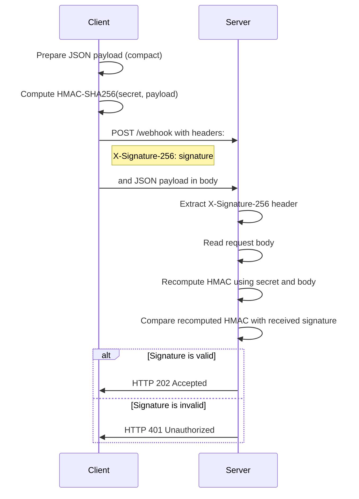
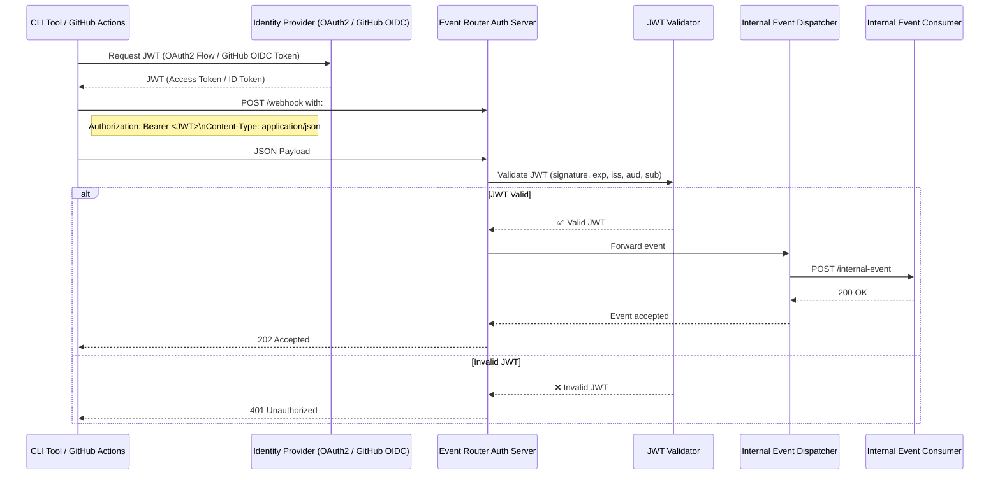

# event-router-auth

A secure internal event delivery gateway written in Go.  
It accepts and routes incoming events from multiple trusted sources (webhooks, CLI, CI/CD pipelines) 
and authenticates each source using the appropriate strategy.

---

## Features

- Accepts **incoming webhook events** from trusted external sources.
- Routes events to **internal microservices** after authentication.
- Implements **multiple authentication strategies**:
	- HMAC (for webhooks) - HMAC is a cryptographic hash function that uses a secret key to verify the integrity and the authenticity of a message.
	- JWT with service accounts (for internal app-to-app)
	- OAuth 2.0 / PAT (for developer CLI usage)
	- OIDC tokens (for GitHub Actions)
	- Optional: mTLS, API keys, Basic Auth

## Use Cases & Authentication Strategies

| Client / Source            | Authentication Method                                | Description                                                           |
|----------------------------|------------------------------------------------------|-----------------------------------------------------------------------|
| **External Webhooks**      | HMAC Signature                                       | Verifies the event source using a pre-shared secret.                  |
| **Internal Services**      | JWT Token (signed via Service Account)               | App-to-App communication using private key–signed tokens.             |
| **Service Account**        | JSON Key → RSA Private Key for JWT signing           | Credentials are securely loaded from disk.                            |
| **Go CLI Tool**            | OAuth 2.0 Device Flow or Personal Access Token (PAT) | Developers can manually push events using a secure CLI.               |
| **GitHub Actions (CI/CD)** | GitHub OIDC Token + Audience Validation              | Validates tokens issued by GitHub Actions using OIDC trust policies.  |
| **mTLS**                   | Mutual TLS (client certificate authentication)       | Ensures both parties (client and server) are authenticated via certs. |
| **API Key**                | API key passed via headers                           | Simple key-based authentication for internal automation.              |
| **Basic Auth**             | Base64-encoded credentials over HTTPS                | For legacy systems or simple admin endpoints.                         |


## Dockerized Setup

This project uses a multi-stage Docker build for smaller image sizes and is fully managed via Docker Compose.

```bash
docker-compose up --build
```

### example payload
```json
{
  "type": "deploy",
  "service": "example-service",
  "env": "production",
  "version": "v1.0.0"
}
```

### How HMAC Authentication Works
- Both parties share a secret key.
- Sender (e.g. GitHub, Some Service) computes a signature: HMAC(key, payload) and adds the signature to the request header (e.g. `X-Signature`).
- Receiver (e.g. event-router-auth) computes the HMAC of the received payload using the same key and compares it with the signature in the header.
- If they match, the request is authenticated and processed; otherwise, it is rejected.

This diagram illustrates the HMAC signing and verification flow between the client and server.




### How JWT Authentication Works
JWT (JSON Web Token) is used for **internal service-to-service** or **CI/CD authentication**, where:

- The **client is trusted**, such as:
	- A backend microservice,
	- An internal CLI tool,
	- Or a GitHub Actions workflow.
- The client **obtains a signed JWT** from a trusted Identity Provider (IDP), such as:
	- An **OAuth 2.0 token endpoint** (for service accounts or CLI apps),
	- Or **GitHub's OIDC provider** (for GitHub Actions).
- The client **sends the token** with the request using the `Authorization` header:
  ```http
  Authorization: Bearer <jwt_token>
  ```
- The event-router-auth server validates the JWT by:
  - Verifying the signature using the public key or secret.
  - Checking the token's claims (issuer, audience, expiration).
  - Optionally validating scopes or permissions.
- If the token is valid, the request is authenticated, and the event is processed.
- If the toekn is missing or invalid, the server responds with an error (e.g., 401 Unauthorized).



