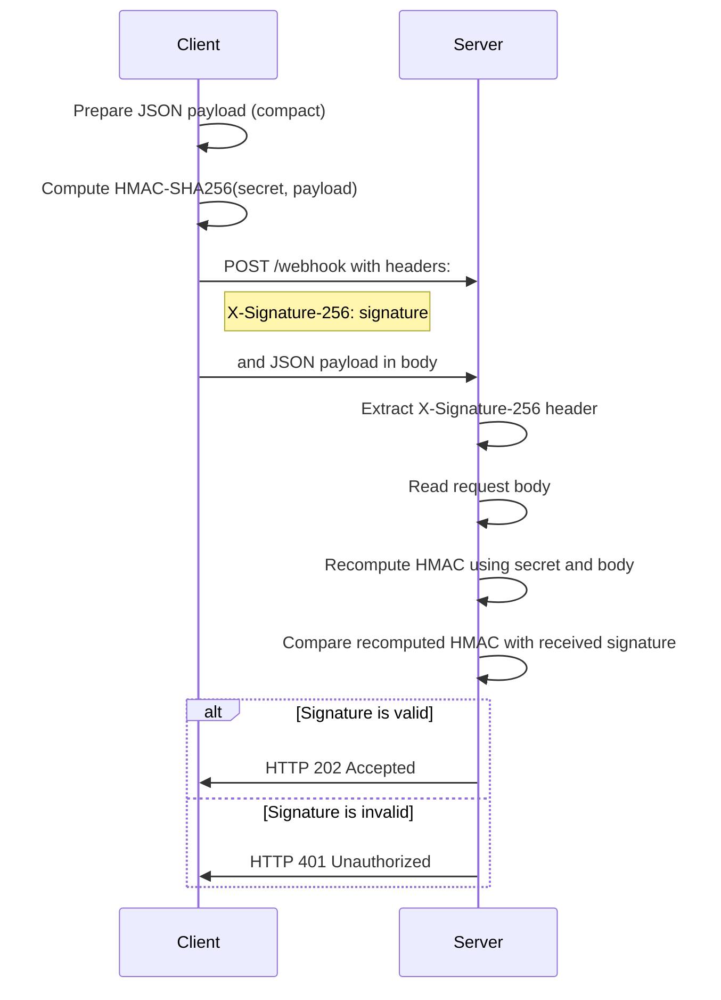
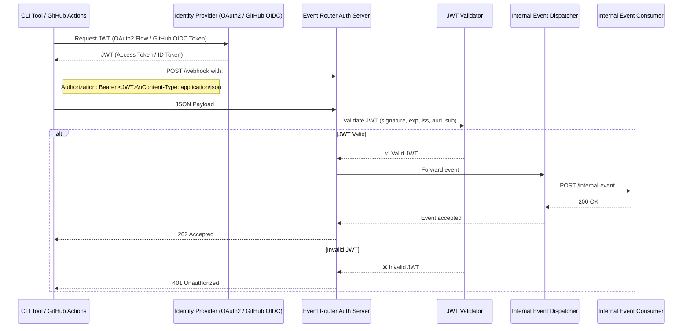
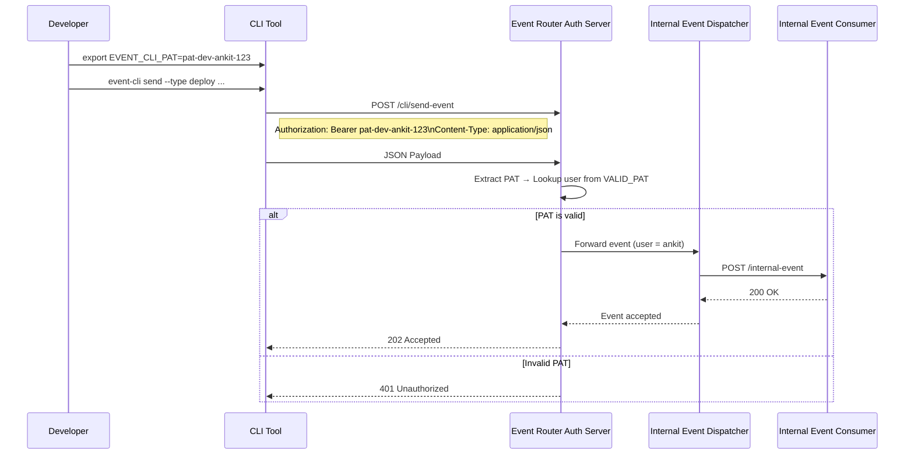
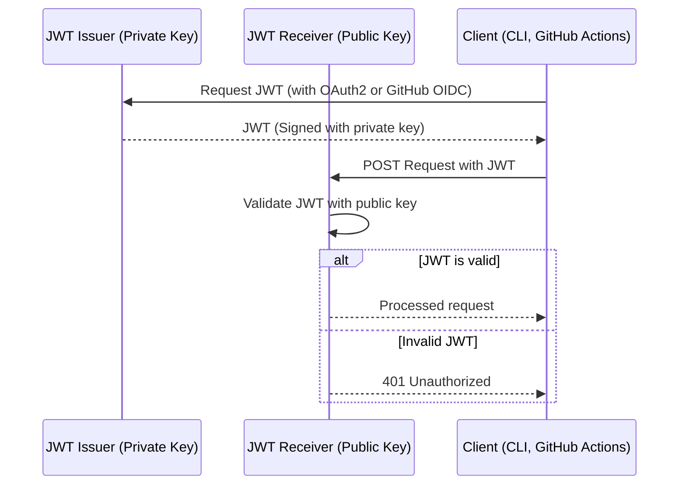

# event-router-auth

A secure internal event delivery gateway written in Go.  
It accepts and routes incoming events from multiple trusted sources (webhooks, CLI, CI/CD pipelines) 
and authenticates each source using the appropriate strategy.

---

## Features

- Accepts **incoming webhook events** from trusted external sources.
- Routes events to **internal microservices** after authentication.
- Implements **multiple authentication strategies**:
	- HMAC (for webhooks) - HMAC is a cryptographic hash function that uses a secret key to verify the integrity and the authenticity of a message.
	- JWT with service accounts (for internal app-to-app)
	- OAuth 2.0 / PAT (for developer CLI usage)
	- OIDC tokens (for GitHub Actions)
	- Optional: mTLS, API keys, Basic Auth

## Use Cases & Authentication Strategies

| Client / Source            | Authentication Method                                | Description                                                           |
|----------------------------|------------------------------------------------------|-----------------------------------------------------------------------|
| **External Webhooks**      | HMAC Signature                                       | Verifies the event source using a pre-shared secret.                  |
| **Internal Services**      | JWT Token (signed via Service Account)               | App-to-App communication using private key–signed tokens.             |
| **Service Account**        | JSON Key → RSA Private Key for JWT signing           | Credentials are securely loaded from disk.                            |
| **Go CLI Tool**            | OAuth 2.0 Device Flow or Personal Access Token (PAT) | Developers can manually push events using a secure CLI.               |
| **GitHub Actions (CI/CD)** | GitHub OIDC Token + Audience Validation              | Validates tokens issued by GitHub Actions using OIDC trust policies.  |
| **mTLS**                   | Mutual TLS (client certificate authentication)       | Ensures both parties (client and server) are authenticated via certs. |
| **API Key**                | API key passed via headers                           | Simple key-based authentication for internal automation.              |
| **Basic Auth**             | Base64-encoded credentials over HTTPS                | For legacy systems or simple admin endpoints.                         |


## Dockerized Setup

This project uses a multi-stage Docker build for smaller image sizes and is fully managed via Docker Compose.

```bash
docker-compose up --build
```

### example payload
```json
{
  "type": "deploy",
  "service": "example-service",
  "env": "production",
  "version": "v1.0.0"
}
```

### How HMAC Authentication Works
- Both parties share a secret key.
- Sender (e.g. GitHub, Some Service) computes a signature: HMAC(key, payload) and adds the signature to the request header (e.g. `X-Signature`).
- Receiver (e.g. event-router-auth) computes the HMAC of the received payload using the same key and compares it with the signature in the header.
- If they match, the request is authenticated and processed; otherwise, it is rejected.

This diagram illustrates the HMAC signing and verification flow between the client and server.




### How JWT Authentication Works
JWT (JSON Web Token) is used for **internal service-to-service** or **CI/CD authentication**, where:

- The **client is trusted**, such as:
	- A backend microservice,
	- An internal CLI tool,
	- Or a GitHub Actions workflow.
- The client **obtains a signed JWT** from a trusted Identity Provider (IDP), such as:
	- An **OAuth 2.0 token endpoint** (for service accounts or CLI apps),
	- Or **GitHub's OIDC provider** (for GitHub Actions).
- The client **sends the token** with the request using the `Authorization` header:
  ```http
  Authorization: Bearer <jwt_token>
  ```
- The event-router-auth server validates the JWT by:
  - Verifying the signature using the public key or secret.
  - Checking the token's claims (issuer, audience, expiration).
  - Optionally validating scopes or permissions.
- If the token is valid, the request is authenticated, and the event is processed.
- If the toekn is missing or invalid, the server responds with an error (e.g., 401 Unauthorized).




# CLI Authentication (PAT-based)

The CLI tool enables internal developers to securely push events to the `event-router-auth` gateway using a **Personal Access Token (PAT)**.

---

## How CLI Authentication Works

- Developers authenticate via a token set in the environment:
  ```bash
  export VALID_PAT=<pat>
  ```
- The CLI tool sends the token in the `Authorization` header:
  ```http
	Authorization: Bearer pat
  ```
- The server validates the token:
- Looks it up in the VALID_PAT environment variable.
- Maps the token to a known user (e.g., ankit, test-bot).
- Injects the identity into the request context.
- Processes the event if the token is valid.



# Local RS256 JWT Verification

To implement JWT authentication using the RS256 algorithm locally, you'll need to generate an RSA key pair and 
use the private key to sign JWTs and the public key to validate them.

## Generate the private key and public key:
```bash
openssl genrsa -out private.pem 2048
openssl rsa -in private.pem -pubout -out public.pem
```

This will create a private.pem and public.pem file that can be used for signing and verifying JWTs.
In the JWT authentication process using the RS256 algorithm, private.pem and public.pem serve as the key pair for signing and verifying JWTs. Here's how each key is used in the process:


1. Private Key (private.pem)

The private key is used to sign the JWT (JSON Web Token). This ensures that the JWT is created by a trusted party (you, as the service generating the token), and it allows the recipient to verify that the token hasn't been tampered with.

    Used by: The JWT issuer (e.g., internal microservice, CLI, GitHub Actions, etc.).

    Function:

        The private key signs the JWT, embedding a digital signature in the token that guarantees its integrity.

        Sign the JWT: When generating the JWT, the private key is used to sign the claims (issuer, audience, expiration, subject, etc.) in the token.


2. Public Key (public.pem)

The public key is used to verify the authenticity of the JWT. When the JWT is received by the server or another service, the public key is used to validate the signature created by the private key. If the public key successfully verifies the signature, it ensures that the token was indeed signed by the trusted entity (the issuer).

    Used by: The JWT recipient (e.g., event-router-auth server or any service validating the JWT).

    Function:

        The public key validates the JWT's signature to ensure that it wasn't tampered with after it was issued.

        It also validates the issuer (iss), audience (aud), expiration (exp), and other claims.

        If the JWT's signature is valid and the claims are correct, the JWT is considered valid.


JWT Creation (Issuer Side):

    The private key (private.pem) is used by the issuer (e.g., a microservice, internal CLI tool, GitHub Actions) to sign the JWT with the appropriate claims (iss, aud, sub, exp).

    This signed token is sent to the client.

JWT Validation (Receiver Side):

    The receiver (e.g., event-router-auth server) extracts the JWT from the Authorization header and validates it.

    The public key (public.pem) is used to verify the signature of the JWT, ensuring that it hasn't been tampered with and that it was issued by a trusted source.

    If the JWT is valid, the request proceeds; if invalid, the server responds with an authentication error (e.g., 401 Unauthorized).


